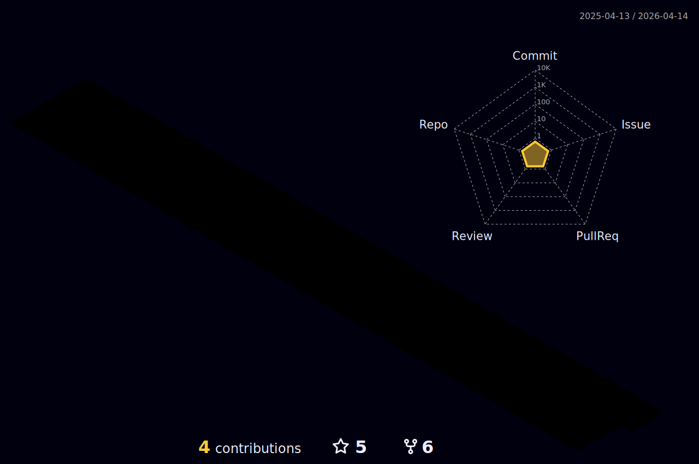

<h1 align="center">Hi , I'm Akshata </h1>
<p align="center">
  <a href="https://github.com/DenverCoder1/readme-typing-svg"></a>
</p>
<hr/>


<h3 align="center">
⭐⭐⭐⭐⭐⭐⭐⭐⭐⭐⭐⭐⭐⭐⭐<br><br>
<i><q>Checkout my portfolio @ <a href="https://akshata-gunapache.github.io/">akshata-gunapache.github.io</a></q></i>
</h3>
<br>

<h2>My Competitive Coding Profiles</h2>

<p align="center">
	<a href="https://leetcode.com/Akshata_4444/"></a>
	<a href="https://www.hackerearth.com/@Akshata-Gunapache"></a>
  <a href="https://www.codechef.com/users/akshata_4444"></a>
	<a href="https://www.hackerrank.com/agunapache28"></a>
	<a href="https://www.codewars.com/users/Akshata-Gunapache"></a>
	
</p>


<h2>My Skills</h2>

<h3>Programming languages</h3>

<p align="center"> 
  &emsp;
    
  &emsp; 
     
  &emsp;
    
  &emsp;
     
  &emsp;
     
</p>

<h3>Software & Tools</h3>
 
<p align="center">
  &emsp;
    <a href="#"></a>
  &emsp;
    <a href="#"></a>
  &emsp;
    <a href="#"></a>
  &emsp;
    <a href="#"></a>
  &emsp;
    <a href="#"> </a>
  &emsp;
    <a href="#"> </a>
  &emsp;
    <a href="#"></a>
  &emsp;
  <a href="#"></a>
  &emsp;
 
<h3>Designing Tools</h3>
<p align="center">
  &emsp;
    <a href="#"> </a>
  &emsp;
    <a href="#"></a>
  &emsp;
    <a href="#"></a>
  &emsp;
	<a href="#"></a>   
&emsp;
	<a href="#"> </a>
  &emsp;
	<a href="#"> </a>
  &emsp;
	
</p>

<h3>Frameworks</h3>

<p align="center"> 
  &emsp;
  <a href="#"></a>
</p>

<h3>Operating Systems</h3>
 
<p align="center">
  &emsp;
    <a href="#"></a>
  &emsp;
    <a href="#"></a>	  
</p>

<br/>
<hr>
<p align="center">
<a href="https://hashnode.com/@AkshataGunapache"></a>
</p>
<hr>

## Github Stats 

<a href="https://github-readme-stats.vercel.app/api?username=Akshata-Gunapache&bg_color=30,e96443,904e95&title_color=fff&text_color=fff">
  
</a>
<a href="https://github-readme-streak-stats.herokuapp.com/?user=Akshata-Gunapache&theme=dark">
  
</a>
<!--
<a href="https://activity-graph.herokuapp.com/graph?username=Akshata-Gunapache&theme=dracula">
  
</a>
-->
<hr>

<a href="https://github-readme-stats.vercel.app/api/top-langs/?username=Akshata-Gunapache&layout=compact&theme=dracula">
  
</a>


 

<details>
 <summary><b><h3> Recent GitHub Activity</h3></summary>
	 
<!--START_SECTION:activity-->
1. 💪 Opened PR [#1](https://github.com/nagesh-merva/CHEFS_BHOJAN_WEBSITE/pull/1) in [nagesh-merva/CHEFS_BHOJAN_WEBSITE](https://github.com/nagesh-merva/CHEFS_BHOJAN_WEBSITE)
2. 🗣 Commented on [#80](https://github.com/VidhiBhatt01/The-Frontend-Store/issues/80) in [VidhiBhatt01/The-Frontend-Store](https://github.com/VidhiBhatt01/The-Frontend-Store)
3. 🗣 Commented on [#80](https://github.com/VidhiBhatt01/The-Frontend-Store/issues/80) in [VidhiBhatt01/The-Frontend-Store](https://github.com/VidhiBhatt01/The-Frontend-Store)
4. 💪 Opened PR [#81](https://github.com/VidhiBhatt01/The-Frontend-Store/pull/81) in [VidhiBhatt01/The-Frontend-Store](https://github.com/VidhiBhatt01/The-Frontend-Store)
5. 💪 Opened PR [#80](https://github.com/VidhiBhatt01/The-Frontend-Store/pull/80) in [VidhiBhatt01/The-Frontend-Store](https://github.com/VidhiBhatt01/The-Frontend-Store)
6. 🗣 Commented on [#65](https://github.com/VidhiBhatt01/The-Frontend-Store/issues/65) in [VidhiBhatt01/The-Frontend-Store](https://github.com/VidhiBhatt01/The-Frontend-Store)
7. ❗️ Opened issue [#68](https://github.com/VidhiBhatt01/The-Frontend-Store/issues/68) in [VidhiBhatt01/The-Frontend-Store](https://github.com/VidhiBhatt01/The-Frontend-Store)
<!--END_SECTION:activity-->
	 
</b>
</details>

### My Coding Activity

<!--START_SECTION:waka-->

```txt
From: 10 April 2022 - To: 10 July 2025

Total Time: 350 hrs 29 mins

C            162 hrs 32 mins >>>>>>>>>>>>-------------   46.37 %
HTML         61 hrs 31 mins  >>>>---------------------   17.55 %
JavaScript   55 hrs 25 mins  >>>>---------------------   15.81 %
CSS          51 hrs 33 mins  >>>>---------------------   14.71 %
Python       12 hrs 10 mins  >------------------------   03.47 %
```

<!--END_SECTION:waka-->

<h2>My DevCard</h2>
<a href="https://app.daily.dev/Akshata"></a>

## Connect with me  
<p align="center">
	<a href="mailto:agunapache28@gmail.com"></a>
	<a href="https://github.com/Akshata-Gunapache"></a>
	<a href="https://www.linkedin.com/in/akshata-gunapache-4a5bb1221/"></a>
	<a href="https://www.instagram.com/_.akshata._.aag._/"></a>
	<a href="https://dribbble.com/akshata_4444"></a>
	<a href="https://twitter.com/agunapache28"></a>
	
</p>

<hr>

<p align="center">
<a href="https://wakatime.com/@1cb65f89-ff53-4b19-ac28-44be15705e07"></a>
<a href="https://komarev.com/ghpvc/?username=Akshata-Gunapache&color=blueviolet"></a>
</p>


<p align="center">
<a href="https://GitHub.com/Akshata-Gunapache/"></a>
&nbsp<a href="https://www.buymeacoffee.com/Akshata"></a>

</p>


[](https://holopin.io/@akshata4444)
